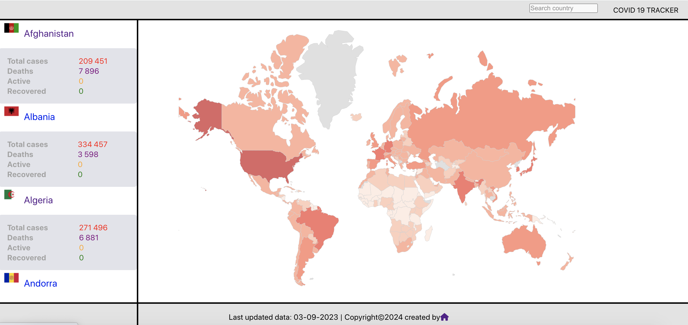
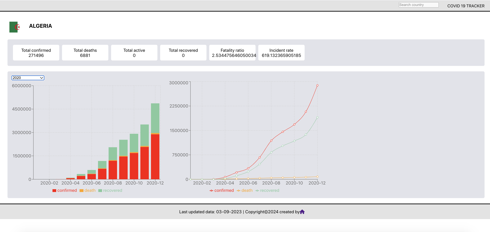

# Coronavirus tracker v2


# About

This new version is the update/refactoring of the source code presented in the open source project published on this [link](https://github.com/mikedido/coronavirus-tracker).

In the new code, I replace the natif javascript by reactJs library and the Python3.7/Falsk by Python3.12/Fastapi. I add a search country bar. 

The library Pandas help the data processing and have a gain in memory and speed of processing.

# Screenshot




# Data : 

The API used the data from jhu -> https://github.com/CSSEGISandData/COVID-19 - Worldwide Data repository operated by the Johns Hopkins University Center for Systems Science and Engineering (JHU CSSE).

# How to test

1. lunch the backend API : 

    Create a virtual env : 
    ```
    python venv -m .venv
    ```
    Lunch the virtualenv : 
    ```
    source .venv/bin/activate
    ```
    install all the necessary package
    ```
    pip install -r requirement
    ```
    Enjoy the API :
    ```
    python main.py
    ````
2. Lunch the frontend ReactJs: 

    Install dependencis:
    ```
    npm install 
    ```
    After the dependencies installation, lunch the frontend :
    ```
    npm start 
    ```
# Author

[Mahdi Gueffaz](mahdi.gueffaz@gmail.com)